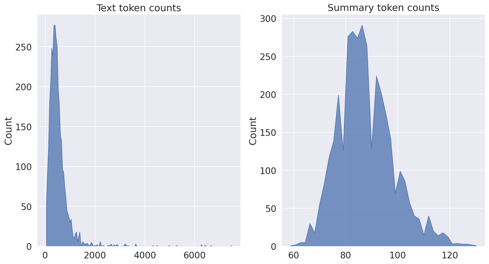
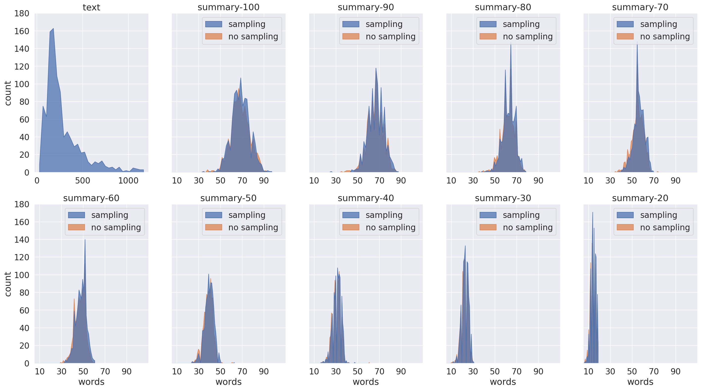
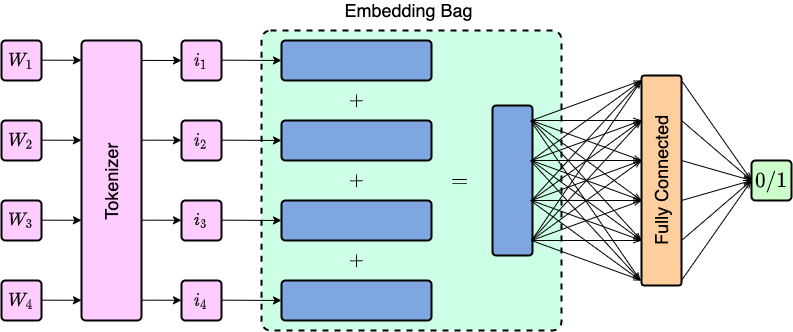
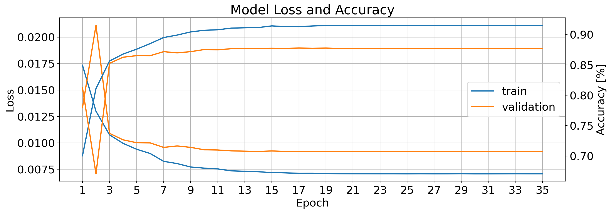
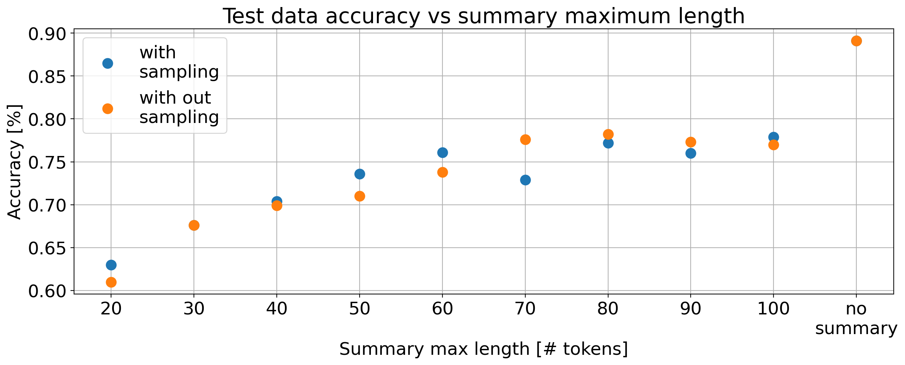

# Machine Summarized Text Sentiment Classification

> This repository contains my project assignement made for the Technion's Electrical Engineering (EE) 046211 course "Deep Learning" by Prof. Daniel Soudry.
---

## Introduction
In this project I will attempt to examine the idea of classifying machine summarized text with the objective of exploring the capabilities of state-of-the-art machine summarization and its biases towards objective information in short summarizations. For that I will use Transfer Learning to fine-tune Google's T5 model into a text summarizer, which will later be used in a summarization pipeline for the IMDB reviews dataset in varying summarization lengths.

## The Code
The code for this project is devided between 3 main parts:

### List of Notebooks

All the notebooks in this repository are contained in the [`notebooks`](/notebooks) folder, and are compatible anad ready to run on google colab.

| #   | Subject                                         | Colab             | Nbviewer               |
|:----:|------------------------------------------------|:-----------------:|:---------------------:|
| 1   | Fine-tune T5 into a summarizer with Transfer Learning                   |         | |
| 2   | IMDB Dataset summarization pipeline                  |         | |
| 3   | Train and test a text classifier for sentiment classification on summarized-IMDB datasets                   |         | 

These three notebooks are supported by the `utils.py` and `models.py` files in the [`src`](/src) folder.

## Datasets
### News Summary
The **News Summary** dataset can be found on Kaggle in the next link 

The T5 model can take inputs of up to 512 tokens, so any sequence with more tokens was truncated in the training process. Here is a token count histograms of the News Summary train dataset. 

### Summarized-IMDB
The summarized-IMDB datasets I generated with T5 can be downloaded by runing the following lines of code:

#### List of IMDB datasets

| #   | Dataset                                         | Link             | 
|:----:|------------------------------------------------|:-----------------:|
| 1   | Train                   | `!gdown --id '1EJD8f_PiymNmhaDuvxj27qTo2OMMruiP' -O 'train.csv'`       
| 2   | Validation                   | `!gdown --id '1--t5cZIL81qBOLjbHxj6iDeXUez5zAvV' -O 'valid.csv'`        
| 3   | Test (with sampling)                   | `!gdown --id '1-2-nT7vtLNMoiUMXuLcWp2wdCryIS9Ep' -O 'test_with_sampling.csv'`|
| 4   | Test (without sampling)                   | `!gdown --id '1-3SD5xYj_R8VaxT15NWs_HbnR5tz7fmP' -O 'test_without_sampling.csv'`|

The Train dataset is identical to the original IMDB Train from Pytorch. The Validation and Test were generated ni the following way:
-  The original IMDB Test dataset was splited to (1000, 24000) samples.
-  The 1000 samples were taken for test (They were the first 1000 in the original IMDB Test) and 24000 for validation.
-  The 1000 Test samples were shuffled and summarized with two different methods: with and without sampling (see [`generate()`](https://huggingface.co/transformers/main_classes/model.html#transformers.generation_utils.GenerationMixin.generate)), and with 11 different summarization lengths of [120, 110, 100, 90, 80, 70, 60, 50, 40, 30, 20] tokens.

Here are histograms of the token counts for each dataset. The title of each plot for the summarized-IMDB word count histograms describes the maximal length parameter value set to the T5 summarizer. Notice that the maximal length parameter of 100 causes a generated average word count of 70 words per summary. In general, the mean word count for each dataset is typically a few dozens of words less than the maximal length value that was set.

## Model

The text classifier architecture that was used for the sentiment classification is illustarted in the figure below. The model is comprised of a single embedding-bag layer followed by a linear fully-connected layer followed by a fully-connected layer with a single unit (binary layer). The $W_k$ variables stand for single words / tokens where ik are their index representation in the model’s vocabulary.

## Results

Loss and Accuracy measured through the training process of the text classifier model.

The classifier accuracy over the test sets. Each point in the graph describes the classifier’s accuracy of predicting the correct classes for the same 1000 test samples sharing the same maximal summary length. The orange data belong to the test sets generated without "sampling" and the blue data belong the ones generated with sampling.

## Conclusions
In this project, I attempted to find the relation between the length of a summarized text piece generated with a state-of-the-art machine summarizer to the amount of subjective information preserved in the machine summarization process. To quantify the amount of subjective information in a text piece I used a sentiment text classifier, and through its performance in classifying correctly the given text, I infer indirectly the quality of the summarization process. From the results I got, it seems that there is a tight connection between the length of the summary to the amount of subjective information kept in the summarized text through the summarization process. We see that shorter summary pieces contain less subjective information which makes them harder to classify in a positive/negative framework. The results are not unambiguous, that is because of a bias towards summaries of lengths longer than 60 words which have been used in the transfer learning process of the T5 fine-tune. To verify if this bias is the main cause of the results we got, we need to use a dataset of shorter summaries in the transfer learning process of the T5 model.

---
## References
- [[1]](https://arxiv.org/abs/1910.10683) Exploring the Limits of Transfer Learning with a Unified Text-to-Text Transformer.
 

